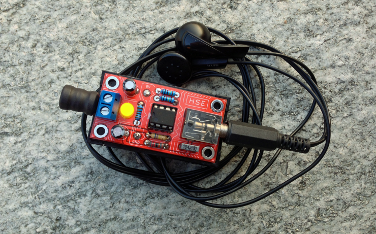
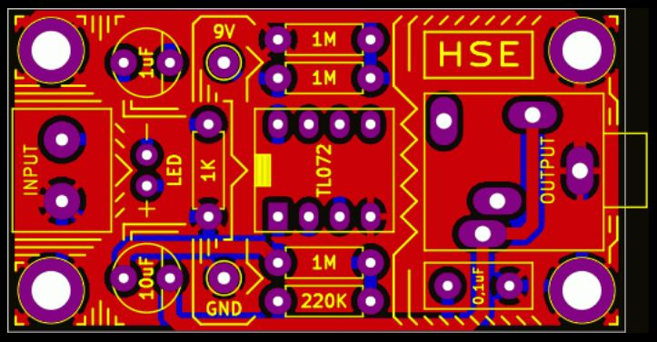

# HSE - Hidden Sound Explorer

Hidden Sound Explorer is a circuit that allows to amplify small voltages
coming from piezo-electric transducer or from inductors (coils).

The output is a 1/8" stereo jack in which you can plug your
headphones to discover a new world of hidden sounds.

I use a 100mH inductor to scope out power supplies, electric motors, smartphones.
Any electromagnetic source will produce a distinct sound. 
Using a piezo disk attached to a vibrating surface you can amplify the vibration.
You can use it on guitar, violin, toothpicks, brums...whatever.

In this repository you can find the PCB production files and the schematic, so you 
can build your own device.

Enjoy.
